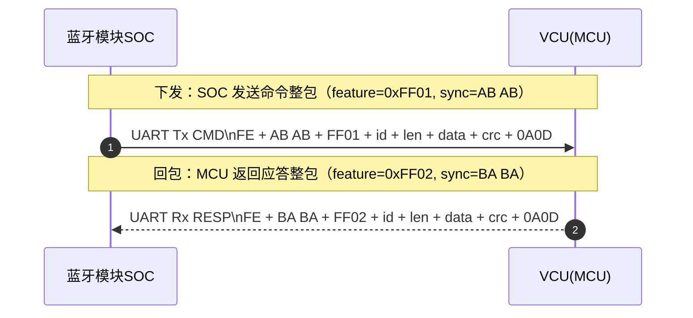

## 通用蓝牙协议
> 此文件用于补全蓝牙架构以及协议相关的说明文档，方便后续维护与开发使用。
### 版本
| 版本号 | 日期       | 作者 | 说明           |
| ------ | ---------- | ---- | -------------- |
| 1.0    | 2026-01-04 | 陈星  | 根据派电 五羊本田设计|

###　协议分析
分析：蓝牙模块和VCU之间主要用两种格式进行通信
- 1. 命令格式
  - 例如APP通过蓝牙模块发送指令给VCU，让VCU执行某些操作(打开座桶锁，寻车鸣笛等)
- 2. 设置格式
  - 例如APP通过蓝牙模块发送设置给VCU，让VCU保存某些参数(胎压阈值，轮胎位置，无感解锁距离等)

根据上述的通用信号格式，可以将蓝牙模块和VCU之间的通信协议进行如下划分：
- 命令协议：通道(feature)=0xFF01（CMD）
  - APP 下发命令给 VCU；VCU 回包时携带结果码（0x00表示成功，0x01表示失败）
- 设置协议：通道(feature)=0xFF03（SETTINGS）
  - APP 下发设置参数给 VCU；VCU 回包时携带结果码（0x00表示成功，0x01表示失败）

#### 命令协议

本章节描述“APP ↔ 蓝牙模块(SOC) ↔ VCU(MCU)”链路中，SOC 与 MCU 之间的**统一命令帧封装**。

为什么需要统一封装
- 上层承载（例如 BLE/UART/SPI 等）只是“搬运字节流”；SOC 与 MCU 仍需要一套**可校验、可扩展、可抗粘包**的二进制帧格式。
- 统一后，命令/设置都复用同一套解析器，减少维护成本与边界 bug（端序、长度、CRC、粘包拆包）。

### 1. 物理帧格式（SOC↔MCU 统一帧，支持任意上层承载）

为避免拆开看不清“一个数据包到底长什么样”，这里按“下发包/回包”把一个数据包的全部字段放到同一张表里。

#### 1.1 下发包（APP → SOC → MCU）整包总表

| 链路段 | head(1B) | sync(1B) | feature(2B) | id(2B) | len(2B) | data(nB) | crc(2B) | end(2B) |
| --- | --- | --- | --- | --- | --- | --- | --- | --- |
| 上层 → SOC（承载写入） | `FE` | `AB` | `FF01/FF03` | 见7章 | 有（大端） | 有 | 有（大端） | `0A 0D` |
| SOC → MCU（UART） | `FE` | `AB` | 同上 | 同上 | 同上 | 同上 | 同上 | `0A 0D` |

说明
- `sync` 为 1 字节：下发固定 `AB`。
- `feature` 为 2 字节自定义特征值（SOC↔MCU 通道字段），用于区分命令/应答/设置等（见第 5 节）。
- `len` 字段定义：`len = id(2B) + data_len(nB)`，不包含 head/sync/feature/len/crc/end。
- 当长度超过单次 BLE 写入最大值（MTU 限制）时，按 6.3 做分包与重组。

#### 1.2 回包（MCU → SOC → APP）整包总表

| 链路段 | head(1B) | sync(1B) | feature(2B) | id(2B) | len(2B) | data(nB) | crc(2B) | end(2B) |
| --- | --- | --- | --- | --- | --- | --- | --- | --- |
| MCU → SOC（UART） | `FE` | `BA` | `FF02/FF04` | 见7章 | 有（大端） | 有 | 有（大端） | `0A 0D` |
| SOC → 上层（承载输出） | `FE` | `BA` | 同上 | 同上 | 同上 | 同上 | 同上 | `0A 0D` |

说明
- `sync` 为 1 字节：回包固定 `BA`。
- MCU 回包用 `BA` 便于 SOC 在串口字节流里快速对齐；SOC 转发到 BLE 时按第 1 节的整包格式发送，APP 更容易理解。
- 你截图里 CRC 标的是 1 字节；你之前提供的 CRC16-CCITT 实现对应 2 字节。这里先按 CRC16(2B) 写死，避免和现有 CRC 描述冲突；如果最终确认是 CRC8(1B)，我再统一改表格与第 2 节。

#### 1.3 字节序（必须统一）

- 全都用大端模式（Big Endian），即高字节在前。
- `len`：2 字节，大端
- `crc16`：2 字节，大端

#### 1.4 总长度计算

- `len = 2(id) + data_len`
- 总帧长度：`frame_len = 1(head) + 1(sync) + 2(feature) + 2(id) + 2(len) + data_len + 2(crc) + 2(end)`

### 2. CRC 定义（CRC16-CCITT/FALSE）

CRC 参数（与 MCU_SOC.md 中的实现一致）
- 多项式：`0x1021`
- 初值：`0xFFFF`
- 不反射：`refin=false`，`refout=false`
- 异或输出：`xorout=0x0000`
- 输出：2字节大端（高字节在前）

CRC 覆盖范围（推荐且必须写死）
- CRC 计算覆盖：`feature + id + len + data`
- 不包含：`head`、`sync`、`end` 与 `crc16` 本身

也就是对下列字节序列计算 CRC16：
- `feature_high(1)`
- `feature_low(1)`
- `id_high(1)`
- `id_low(1)`
- `len_high(1)`
- `len_low(1)`
- `data[0..data_len-1]`（其中 `data_len = len - 2`）

为什么这样设计
- `sync` 只用于对齐；把 CRC 覆盖到 `id/len/data` 可以同时校验“命令号与长度”，能显著降低错帧误判。

### 3. 命令/应答载荷约定（建议统一）

为了避免同一命令连续发送（或重传）导致应答对不上的问题，建议所有命令都在 data 中包含 `seq`。

#### 3.1 请求（SOC → MCU）

- `data = seq(1B) + payload(...)`

#### 3.2 应答（MCU → SOC）

- `data = seq(1B) + result(1B) + payload(...)`
- `result` 建议定义：
  - `0x00`：成功
  - `0x01`：失败（通用失败）
  - `0x02`：参数错误/长度错误
  - `0x03`：不支持该命令
  - `0x04`：忙/资源占用
  - `0x05`：状态不允许（例如未初始化/未鉴权等）

为什么要 seq
- 只靠 `id` 不能区分“同一命令的第 1 次/第 2 次发送”，引入 `seq` 可稳定匹配应答，后续也便于做 ACK/重传。

### 4. 粘包/拆包处理（流式解析规则）

SOC/MCU/SOC(BLE重组) 接收端必须按字节流解析（适用于 UART、也适用于 BLE 分片或一次收到多帧的情况）：

1. 在接收缓冲区中扫描 `head`（固定 `0xFE`）
2. 校验后续 `sync` 是否为预期（下发 `AB AB` / 回包 `BA BA`）
3. 读取 `feature(2)`、`id(2)` 与 `len(2)`，得到 `data_len = len - 2`（len = id(2B) + data_len）
4. 校验 `data_len` 是否超出上限（例如缓冲区最大值），否则丢弃该 head 并继续找下一处
5. 等待接收完整 `data(data_len)`、`crc(2)` 与 `end(0A 0D)`
6. 校验 `end` 固定为 `0A 0D`，并计算 CRC（第 2 节），通过则上报一帧；失败则丢弃该帧并继续找下一处 head

### 5. 自定义特征值（SOC↔MCU 通道字段）

重要说明（避免误解）
- 本文的“特征值”不是 BLE 的 GATT 特征值 UUID。
- 这里的“特征值”是 SOC↔MCU 协议内的**自定义通道字段**（作为帧字段参与传输与校验），用于区分命令/应答/设置等不同类型的数据包。

建议取值（前面协议划分保持一致）
- `0xFF01`：命令（CMD）
- `0xFF02`：命令应答（RESP）
- `0xFF03`：设置（SETTINGS）
- `0xFF04`：设置应答（RESP_SETTINGS）

说明
- 上层承载（例如 BLE、UART、SPI 等）只负责把“整包字节流”搬运出去；真正区分通道靠该自定义特征值字段。

### 6. 上层承载与分包（可选：BLE/串口等）

本节回答“整包怎么承载出去”：上层如何分包、如何重组、以及如何与 SOC↔MCU 物理帧对应。

#### 6.1 上层承载方式（以 BLE 为例，可替换）

如果上层是 BLE（仅举例，不影响 SOC↔MCU 帧定义）：
- APP 写入：把“整包字节流”写入一个写特征值
- APP 接收：订阅 notify，从 notify 特征值接收“整包字节流”

为什么常用 Notify
- 应答是异步的：MCU 执行耗时 + SOC↔MCU 传输时延，无法保证在一次写操作内同步返回。
- Notify 适合连续上报/多条应答，上层实现也更简单。

#### 6.2 上层 value 与 SOC↔MCU 物理帧的映射（建议固定一条规则）

推荐规则（建议优先采用）
- 上层承载内容：`FE + sync + feature(2B) + id + len + data + crc + 0A 0D`
- 与第 1 节整包总表保持一致：SOC 侧做“重组 + 校验 + 透传”，无需补/去字段
- 下发 sync 固定为 `AB AB`，回包 sync 固定为 `BA BA`

为什么 BLE 也携带 head/sync/end
- 最直观：BLE 抓到的包与 UART 抓到的包结构一致，联调成本最低。
- 最安全：避免 SOC 在两层之间“补字段/删字段”引入错位 bug。


#### 6.3 分包与重组（MTU/长包）

当 `FE+sync+id+len+data+crc+0A0D` 超过单次 BLE 写入最大长度（由 MTU 决定）时：
- APP：按字节流分多次 write 连续写入
- SOC：按字节流缓存并重组；当收到完整整包后再进行 CRC 校验与转发

为什么必须重组
- BLE 一次 write 可能只包含“半帧”。如果 SOC 误把“每次 write 都当作完整一帧”，会造成 CRC 失败/丢包/误判。

#### 6.4 一次完整交互流程（命令）

1) SOC → MCU：通过 UART 下发命令整包 `FE + AB AB + feature(FF01) + id + len + data + crc + 0A 0D`
2) MCU → SOC：通过 UART 返回应答整包 `FE + BA BA + feature(FF02) + id + len + data + crc + 0A 0D`



### 7. 基本数据定义
> 此章节定义了基本的数据结构，用于在代码进行protocol的解析，封装等操作

**数据包定义**

``` cpp
typedef struct {
    uint8_t head;            // 1 byte, 固定为 0xFE
    uint8_t sync;           // 1 byte, 下发包为 0xAB，回包为 0xBA
    uint16_t feature;       // 2 bytes, 通道字段（大端）
    uint16_t id;            // 2 bytes, 命令 ID（大端）
    uint16_t len;           // 2 bytes, 长度（大端）
    uint8_t *data;          // n bytes, 数据载荷
    uint16_t crc;           // 2 bytes, CRC16（大端）
    uint8_t end[2];         // 2 bytes, 固定为 0x0A0D
} BleFrame_t;
```

#### 7.1 命令基础定义

> 本节用于定义根据派电 五羊本田的需求所定义的基础命令号及其含义，后续可以直接的添加方便后续的维护与开发

说明（非常关键，避免后续实现出 bug）：
- 本协议已统一 `id` 为 2 字节（大端），用于支持 `0x100~0xFFFF` 的命令扩展。
- 关键配套规则：`len = id(2B) + data_len`，因此 `data_len = len - 2`；CRC 覆盖范围必须包含 `feature + id(2B) + len + data`。
- 如果仍有任意一端按 1 字节解析/组帧，会出现“命令号截断、长度错位、CRC 校验失败”等问题。

##### 7.1.1 CMD 命令号总表

| 名称 | ID | 说明 | 请求数据格式（SOC → MCU） | 应答数据格式（MCU → SOC） |
|---|---|---|---|---|
| CMD_CONNECT | 0x01 | 蓝牙连接命令（鉴权完成后 SOC 主动发给 MCU） | seq(1B) | seq(1B) + result(1B) |
| CMD_BLE_FACTORY_RESET | 0x16 | 蓝牙恢复出厂设置 | seq(1B) | seq(1B) + result(1B) |
| CMD_BLE_CANCEL_PAIRING | 0x17 | 取消蓝牙配对 | seq(1B) | seq(1B) + result(1B) |
| CMD_ADD_NFC_KEY | 0x20 | 添加NFC钥匙（与 NFC 模块相关） | seq(1B) + add_control(1B) | seq(1B) + result(1B) + uuid(4B) + key(6B) |
| CMD_DELETE_NFC_KEY | 0x21 | 删除NFC钥匙 | seq(1B) + delete_control(1B) + uuid(4B) + key(6B) | seq(1B) + result(1B) |
| CMD_FIND_NFC_KEY | 0x22 | 查找NFC钥匙 | seq(1B) | seq(1B) + result(1B) + uuid(4B) + key(6B) |
| CMD_NFC_UNLOCK | 0x23 | NFC解锁 | seq(1B) | seq(1B) + result(1B) |
| CMD_NFC_LOCK | 0x24 | NFC锁车 | seq(1B) | seq(1B) + result(1B) |
| CMD_NFC_SWITCH | 0x25 | NFC开关（00关/01开） | seq(1B) + status(1B) | seq(1B) + result(1B) |
| CMD_OIL_VEHICLE_UNPREVENTION | 0x30 | 油车解防 | seq(1B) | seq(1B) + result(1B) |
| CMD_OIL_VEHICLE_PREVENTION | 0x31 | 油车防盗 | seq(1B) | seq(1B) + result(1B) |
| CMD_OIL_VEHICLE_FIND_STATUS | 0x32 | 油车寻车状态查询（携带 DATA：音量等） | seq(1B) + volume(1B) | seq(1B) + result(1B) |
| CMD_OIL_VEHICLE_UNLOCK_TRUNK | 0x33 | 油车尾箱解锁 | seq(1B) | seq(1B) + result(1B) |
| CMD_OIL_VEHICLE_LOCK_TRUNK | 0x34 | 油车尾箱锁车 | seq(1B) | seq(1B) + result(1B) |
| CMD_VEHICLE_UNLOCK_SEAT | 0x35 | 座桶解锁 | seq(1B) | seq(1B) + result(1B) |
| CMD_VEHICLE_LOCK_SEAT | 0x36 | 座桶锁车 | seq(1B) | seq(1B) + result(1B) |
| CMD_VEHICLE_MUTE_SETTING | 0x37 | 静音设置（00关/01开） | seq(1B) + status(1B) | seq(1B) + result(1B) |
| CMD_VEHICLE_UNLOCK_MIDDLE_BOX | 0x38 | 中箱锁解锁 | seq(1B) | seq(1B) + result(1B) |
| CMD_VEHICLE_LOCK_MIDDLE_BOX | 0x39 | 中箱锁锁车 | seq(1B) | seq(1B) + result(1B) |
| CMD_VEHICLE_EMERGENCY_MODE_LOCK | 0x40 | 紧急模式打开 | seq(1B) | seq(1B) + result(1B) |
| CMD_VEHICLE_EMERGENCY_MODE_UNLOCK | 0x41 | 紧急模式关闭 | seq(1B) | seq(1B) + result(1B) |
| CMD_BLE_MAC_READ | 0x42 | 读取蓝牙MAC地址 | seq(1B) | seq(1B) + result(1B) + mac(6B) |
| CMD_SINGLE_CONTROL_UNLOCK | 0x43 | 单控开锁（尾箱锁） | seq(1B) | seq(1B) + result(1B) |
| CMD_Assistive_trolley_mode_on | 0x44 | 助力推车模式开启 | seq(1B) | seq(1B) + result(1B) |
| CMD_Assistive_trolley_mode_off | 0x45 | 助力推车模式关闭 | seq(1B) | seq(1B) + result(1B) |
| CMD_Assistive_trolley_mode_default | 0x46 | 助力推车默认 | seq(1B) | seq(1B) + result(1B) |
| CMD_Delayed_headlight_on | 0x47 | 延时大灯开启 | seq(1B) | seq(1B) + result(1B) |
| CMD_Delayed_headlight_off | 0x48 | 延时大灯关闭 | seq(1B) | seq(1B) + result(1B) |
| CMD_Delayed_headlight_default | 0x49 | 延时大灯默认 | seq(1B) | seq(1B) + result(1B) |
| CMD_Delayed_headlight_time_set | 0x50 | 延时大灯时间设置（5~120秒） | seq(1B) + time(2B) | seq(1B) + result(1B) |
| CMD_Charging_power_set | 0x51 | 充电功率设置（档位：30/22/16/6 kW） | seq(1B) + power(1B) | seq(1B) + result(1B) |
| CMD_AUTO_P_GEAR_on | 0x52 | 自动P档开启 | seq(1B) | seq(1B) + result(1B) |
| CMD_AUTO_P_GEAR_off | 0x53 | 自动P档关闭 | seq(1B) | seq(1B) + result(1B) |
| CMD_AUTO_P_GEAR_default | 0x54 | 自动P档默认 | seq(1B) | seq(1B) + result(1B) |
| CMD_AUTO_P_GEAR_time_set | 0x55 | 自动P档时间设置（10~120s） | seq(1B) + time(2B) | seq(1B) + result(1B) |
| CMD_Chord_horn_on | 0x56 | 和弦喇叭开启 | seq(1B) | seq(1B) + result(1B) |
| CMD_Chord_horn_off | 0x57 | 和弦喇叭关闭 | seq(1B) | seq(1B) + result(1B) |
| CMD_Chord_horn_default | 0x58 | 和弦喇叭默认 | seq(1B) | seq(1B) + result(1B) |
| CMD_Chord_horn_type_set | 0x59 | 和弦喇叭音源设置（data 1B） | seq(1B) + type(1B) | seq(1B) + result(1B) |
| CMD_Chord_horn_volume_set | 0x60 | 和弦喇叭音量设置（data 1B） | seq(1B) + volume(1B) | seq(1B) + result(1B) |
| CMD_Three_shooting_lamp_on | 0x61 | 三射灯氛围灯开启 | seq(1B) | seq(1B) + result(1B) |
| CMD_Three_shooting_lamp_off | 0x62 | 三射灯氛围灯关闭 | seq(1B) | seq(1B) + result(1B) |
| CMD_Three_shooting_lamp_default | 0x63 | 三射灯氛围灯默认 | seq(1B) | seq(1B) + result(1B) |
| CMD_Three_shooting_lamp_mode_set | 0x64 | 三射灯模式设置（效果1B+渐变1B+颜色3B） | seq(1B) + effect(1B) + gradient(1B) + color(3B) | seq(1B) + result(1B) |
| CMD_Assistive_reversing_gear_on | 0x65 | 辅助倒车档位开启 | seq(1B) | seq(1B) + result(1B) |
| CMD_Assistive_reversing_gear_off | 0x66 | 辅助倒车档位关闭 | seq(1B) | seq(1B) + result(1B) |
| CMD_Assistive_reversing_gear_default | 0x67 | 辅助倒车档位默认 | seq(1B) | seq(1B) + result(1B) |
| CMD_Automatic_steering_reset_on | 0x75 | 自动转向回位开启 | seq(1B) | seq(1B) + result(1B) |
| CMD_Automatic_steering_reset_off | 0x76 | 自动转向回位关闭 | seq(1B) | seq(1B) + result(1B) |
| CMD_Automatic_steering_reset_default | 0x77 | 自动转向回位默认 | seq(1B) | seq(1B) + result(1B) |
| CMD_EBS_switch_on | 0x78 | EBS 开启（data：EBS类型 1B） | seq(1B) + type(1B) | seq(1B) + result(1B) |
| CMD_Low_speed_gear_on | 0x79 | 低速档位开启 | seq(1B) | seq(1B) + result(1B) |
| CMD_Low_speed_gear_off | 0x80 | 低速档位关闭 | seq(1B) | seq(1B) + result(1B) |
| CMD_Low_speed_gear_default | 0x81 | 低速档位默认 | seq(1B) | seq(1B) + result(1B) |
| CMD_Low_speed_gear_speed_set | 0x82 | 低速档位速度设置（00/01/10/11） | seq(1B) + speed(1B) | seq(1B) + result(1B) |
| CMD_Medium_speed_gear_on | 0x83 | 中速档位开启 | seq(1B) | seq(1B) + result(1B) |
| CMD_Medium_speed_gear_off | 0x84 | 中速档位关闭 | seq(1B) | seq(1B) + result(1B) |
| CMD_Medium_speed_gear_default | 0x85 | 中速档位默认 | seq(1B) | seq(1B) + result(1B) |
| CMD_Medium_speed_gear_speed_set | 0x86 | 中速档位速度设置（00/01/10/11） | seq(1B) + speed(1B) | seq(1B) + result(1B) |
| CMD_High_speed_gear_on | 0x87 | 高速档位开启 | seq(1B) | seq(1B) + result(1B) |
| CMD_High_speed_gear_off | 0x88 | 高速档位关闭 | seq(1B) | seq(1B) + result(1B) |
| CMD_High_speed_gear_default | 0x89 | 高速档位默认 | seq(1B) | seq(1B) + result(1B) |
| CMD_High_speed_gear_speed_set | 0x90 | 高速档位速度设置（00/01/10/11） | seq(1B) + speed(1B) | seq(1B) + result(1B) |
| CMD_Lost_mode_on | 0x91 | 丢失模式开启 | seq(1B) | seq(1B) + result(1B) |
| CMD_Lost_mode_off | 0x92 | 丢失模式关闭（默认） | seq(1B) | seq(1B) + result(1B) |
| CMD_TCS_switch_on | 0x93 | TCS 开启 | seq(1B) | seq(1B) + result(1B) |
| CMD_TCS_switch_off | 0x94 | TCS 关闭 | seq(1B) | seq(1B) + result(1B) |
| CMD_Side_stand_switch_on | 0x95 | 侧支架开启 | seq(1B) | seq(1B) + result(1B) |
| CMD_Side_stand_switch_off | 0x96 | 侧支架关闭 | seq(1B) | seq(1B) + result(1B) |
| CMD_Battery_type_set | 0x97 | 电池模式（00铅酸/01锂电） | seq(1B) + type(1B) | seq(1B) + result(1B) |
| CMD_Battery_capacity_set | 0x98 | 电池容量（单位Ah） | seq(1B) + capacity(2B) | seq(1B) + result(1B) |
| CMD_KFA_2KGA_2MQA_data_sync | 0x99 | KFA/2KGA/2MQA 数据同步（车型定义） | seq(1B) + model(1B) | seq(1B) + result(1B) |
| CMD_HDC_switch_on | 0x100 | HDC 开启 | seq(1B) | seq(1B) + result(1B) |
| CMD_HDC_switch_off | 0x101 | HDC 关闭 | seq(1B) | seq(1B) + result(1B) |
| CMD_HHC_switch_on | 0x102 | HHC 开启 | seq(1B) | seq(1B) + result(1B) |
| CMD_HHC_switch_off | 0x103 | HHC 关闭 | seq(1B) | seq(1B) + result(1B) |
| CMD_Starting_strength_set | 0x104 | 起步强度设置 | seq(1B) + strength(1B) | seq(1B) + result(1B) |
| CMD_SPORT_mode_on | 0x105 | SPORT 开启 | seq(1B) | seq(1B) + result(1B) |
| CMD_SPORT_mode_off | 0x106 | SPORT 关闭 | seq(1B) | seq(1B) + result(1B) |
| CMD_SPORT_mode_default | 0x107 | SPORT 默认 | seq(1B) | seq(1B) + result(1B) |
| CMD_SPORT_mode_type_set | 0x108 | SPORT 类型设置 | seq(1B) + type(1B) | seq(1B) + result(1B) |
| CMD_ECO_mode_on | 0x109 | ECO 开启 | seq(1B) | seq(1B) + result(1B) |
| CMD_ECO_mode_off | 0x110 | ECO 关闭 | seq(1B) | seq(1B) + result(1B) |
| CMD_ECO_mode_default | 0x111 | ECO 默认 | seq(1B) | seq(1B) + result(1B) |
| CMD_ECO_mode_type_set | 0x112 | ECO 类型设置 | seq(1B) + type(1B) | seq(1B) + result(1B) |
| CMD_Radar_switch_on | 0x113 | 雷达开启 | seq(1B) | seq(1B) + result(1B) |
| CMD_Radar_switch_off | 0x114 | 雷达关闭 | seq(1B) | seq(1B) + result(1B) |
| CMD_Radar_switch_default | 0x115 | 雷达默认 | seq(1B) | seq(1B) + result(1B) |
| CMD_Radar_sensitivity_set | 0x116 | 雷达灵敏度（00低/01中/02高） | seq(1B) + sensitivity(1B) | seq(1B) + result(1B) |
| CMD_Tire_pressure_monitoring_get | 0x117 | 胎压监测数据获取 | seq(1B) + wheel(1B) | seq(1B) + result(1B) + wheel(1B) + id(4B) + pressure(2B) + temperature(1B) + voltage(2B) + status(1B) + mac(6B) |
